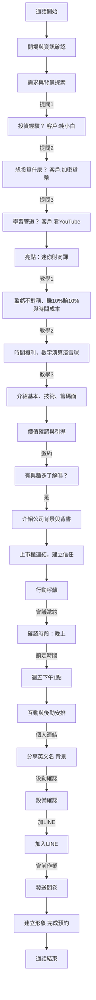

# 財經架構

文字: 通話流程包括需求探索、投資經驗確認、學習管道介紹，並透過迷你財商課教學，最終建立信任並安排會議。流程中涉及互動與後勤確認。

```mermaid
graph TD
    A[通話開始] --> B[開場與資訊確認]
    B --> C[需求與背景探索]
    C -- 提問1 --> D[投資經驗？ 客戶:純小白]
    D -- 提問2 --> E[想投資什麼？ 客戶:加密貨幣]
    E -- 提問3 --> F[學習管道？ 客戶:看YouTube]
    F --> G[亮點：迷你財商課]
    G -- 教學1 --> H[盈虧不對稱、賺10%賠10%與時間成本]
    H -- 教學2 --> I[時間複利，數字演算滾雪球]
    I -- 教學3 --> J[介紹基本、技術、籌碼面]
    J --> K[價值確認與引導]
    K -- 邀約 --> L[有興趣多了解嗎？]
    L -- 是 --> M[介紹公司背景與背書]
    M --> N[上市櫃連結，建立信任]
    N --> O[行動呼籲]
    O -- 會議邀約 --> P[確認時段：晚上]
    P -- 鎖定時間 --> Q[週五下午1點]
    Q --> R[互動與後勤安排]
    R -- 個人連結 --> S[分享英文名 背景]
    S -- 後勤確認 --> T[設備確認]
    T -- 加LINE --> U[加入LINE]
    U -- 會前作業 --> V[發送問卷]
    V --> W[建立形象 完成預約]
    W --> Z[通話結束]
```