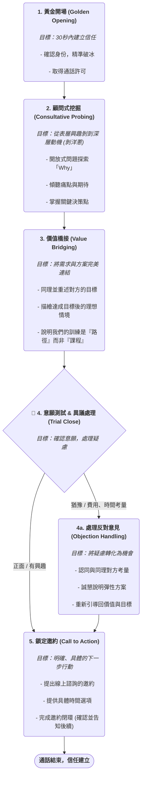

# 開發原則

文字: 開發原則包括五個主要步驟：建立信任、深入挖掘需求、將需求與方案連結、確認意願並處理疑慮，以及明確提出行動邀約。每個步驟都有具體的執行策略和應避免的陷阱，以確保有效的溝通和成功的預約。

---

### **各階段架構深度解析**

- **目標：** 快速消除戒心，讓對方知道你不是隨機騷擾，而是有正當理由聯繫他。
- **核心心法：** 「我不是陌生人，我是來延續我們之前緣分的。」
- **具體執行步驟：**
    1. **稱呼全名與自我介紹：** 「喂，你好，請問是林小姐嗎？你好，我這邊是X Platform職能共學平台的顧問Terry。」 完整且專業，給予尊重。
    2. **建立關聯性 (最關鍵的一步)：** 立刻說明你為什麼知道他。「會打這通電話，主要是因為有看到你之前有報名過我們的『六指淵特效講座』/『UIUX設計懶人包』，想說關心一下你目前的學習狀況。」  這是把「冷開發」變「溫開發」的技巧。
    3. **確認通話意願與時長：** 「不曉得你現在方便講個電話嗎？大概花您 3-5 分鐘的時間就好。」 尊重對方時間，給予明確的時間預期，能大幅降低掛斷率。
- **應避免的陷阱：**
    - **話術感過重：** 「小姐妳好，在忙嗎？」這種開場白極易觸發防衛機制。
    - **資訊不對稱：** 打電話前連對方報名了什麼都不知道，這會顯得極不專業。

---

- **目標：** 從表面的興趣，層層深入挖掘到對方內心真正的「動機 (Motivation)」、「痛點 (Pain Point)」**與**「期望 (Expectation)」
- **核心心法： 「我是來幫助你釐清職涯方向的顧問，讓我聽聽你的故事。」**
- **具體執行步驟與關鍵問法：**
    1. **現況盤點：** 「想先簡單了解，你目前是在學還是已經在工作了呢？是什麼領域的？」
    2. **探索動機 (Why)：** 「那當初怎麼會想要開始對這一塊有興趣呢？」 **這題是挖掘的起點。**
    3. **深挖痛點 (What's stopping you?)：**
        - 「那你目前是透過什麼方式在學習呢？線上課程還是自學居多？」
        - 「那在這個過程中，有沒有碰到什麼讓你覺得比較卡關或困擾的地方？」**這是診斷的核心。**
    4. **釐清目標 (Where do you want to be?)：**
        - 「那你會希望學完這項技能後，完成一個什麼樣的目標？是想順利轉職、培養第二專長接案，還是有自己的專案想完成？」
        - **針對性追問：**（若提到轉職）「那你希望在多久時間內轉職成功？期望的薪資大概落在哪個範圍？」
- **應避免的陷阱：**
    - **急於推銷：** 還沒搞清楚對方狀況，就開始介紹課程有多棒，對方會覺得你在自說自話。
    - **問卷式提問：** 連續問封閉式問題，讓對話變成一問一答，缺乏溫度。
    - **忽略細節：** 對方可能輕描淡寫地提到「做作品集很難」，這就是你的切入點，一定要追問下去！

---

- **目標：** 巧妙地將對方前面提到的需求、痛點、目標，與我們的服務方案搭起一座橋樑。
- **核心心法：** 「我理解你的問題了，而我這裡正好有一條可以幫你走到目標的路徑。」
- **具體執行步驟：**
    1. **同理與總結：** 先用一句話總結對方的困境與目標。「喔！所以我聽起來，你的情況是，雖然你有自學的經驗，但一直缺乏一個完整的、能證明你實力的專案作品，所以導致你對求職轉職比較沒有信心，是這樣嗎？」**這會讓對方感覺你真的有在聽。**
    2. **呈現解決方案 (Path)：** 針對他的痛點，提出我們的解方。「其實我們這邊的教練課，就是為了解決像你這樣的問題。我們不是單純上課，而是直接讓在業界的公司總監，一對一帶著你從零到一完成一個真實的商業專案。」
    3. **強調獨特價值 (Unique Value)：** 說明我們的服務和坊間的差異。「這個模式的好處是，你不只學到技術，更重要的是學到業界的思維跟工作流程，這是外面影片課程完全學不到的。」
- **應避免的陷阱：**
    - **空泛的介紹：** 只是說「我們的課程很棒」，卻沒有連結到對方的個人需求。
    - **談論特點而非利益：** 「我們有200小時的影片」是特點。「讓你在三個月內完成一個電商網站」是利益。永遠談利益。

---

- **目標：** 測試對方是否跟上了你的節奏，並主動、誠懇地化解他心中的疑慮。
- **核心心法： 「疑慮是溝通的機會，不是拒絕的信號。」**
- **具體執行步驟：**
    1. **試探性邀約：** 在介紹完價值後，拋出一個軟性的問題來確認意願。「那像這樣子的學習方式，你會不會想再花點時間，深入了解看看具體的細節？」
    2. **主動破除疑慮 (時間與金錢)：** 這是最常見的兩大疑慮，可以主動提及。「我猜你可能也會考量到時間和預算的問題，這部分你不用擔心，我們的訓練是客製化的，時間可以彈性安排，費用上我們也有提供不同的分期方案。」**主動出擊能展現你的誠意。**
- **應避免的陷-阱：**
    - **給予壓力：** 「那你覺得怎樣？要不要報名？」這會嚇跑客戶。
    - **迴避問題：** 對於費用問題含糊其辭，會讓對方覺得不夠透明。

---

- **目標：** 讓通話有一個明確的結果 **成功的預約**。這是整通電話的最終目的。
- **核心心法：** 「讓我們的下一次溝通，為你的職涯帶來真正的改變。」
- **具體執行步驟：**
    1. **提出明確行動：** 「好，那我想邀請你，我們另外約一個一小時的線上會議，我會用畫面分享，直接給你看我們學員的作品，以及詳細的學習地圖，完整幫你規劃。」
    2. **提供選項並主導時間：** 不要問「你什麼時候有空？」，而是「你看是平日的晚上，還是週末的下午比較方便？... 那下週二晚上八點這個時間你可以嗎？」**將問答題變成選擇題，能大幅提高成功率。**
    3. **完成邀約閉環 (The Loop)：** 在確定時間後，立刻告知他接下來的步驟，讓他有安全感。「太好了！那我們就約定下週二晚上八點。我等一下會用這個手機號碼加你的 LINE，然後把會議連結和一些你需要先看的資料傳給你，我們到時候線上見！」
- **應避免的陷阱：**
    - **模糊的結尾：** 「好，那我再跟你聯絡哦！」這是最失敗的結尾，等於沒有結果。
    - **忘記重申約定時間：** 掛電話前，務必再次口頭確認「好的，那就禮拜二晚上八點囉！」加深印象。