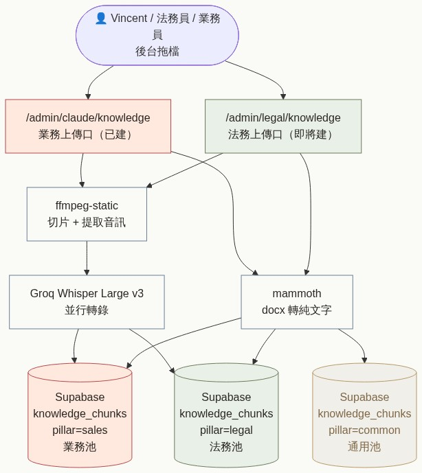
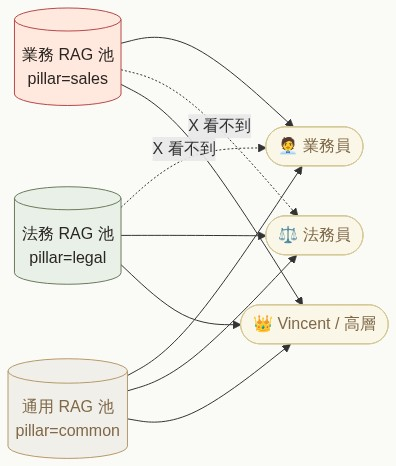
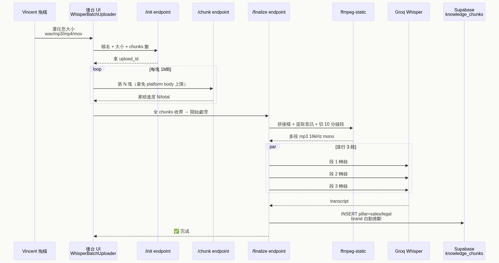
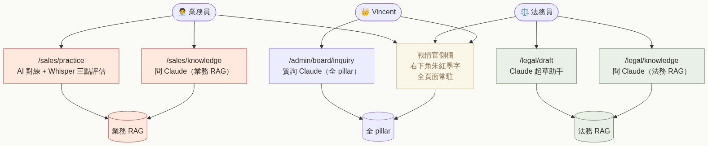

# RAG 知識庫架構(2026-05-01)

> 對齊 system-tree v2 §RAG + Vincent 鐵則「不從零生」+ 紅線 1 secret 隔離

---

## 圖 1:整體架構 — 資料怎麼進系統



**2 個上傳口、3 個 pillar 池、2 條 pipeline**:

| 入口 | 進哪個 pillar | 給誰用 |
|---|---|---|
| `/admin/claude/knowledge`(中央管理) | 預設 sales(可推斷) | super_admin |
| `/admin/legal/knowledge`(法務專用) | 強制 legal | 法務員 / Vincent |

Pipeline 共用:
- **ffmpeg-static + nix system ffmpeg**:任何 audio/video → mp3 16kHz mono 32kbps
- **Groq Whisper Large v3**:並行 3 段轉錄(throttle)
- **mammoth**:.docx → 純文字

進 `knowledge_chunks` 後,Supabase pgvector 自動 indexed(HNSW)。

---

## 圖 2:權限隔離 — 誰看得到什麼



**核心設計:RAG search 端 query level 隔離,不靠前端 hide**。

```ts
// src/lib/rag-pillars.ts
const ROLE_PILLAR_MAP = {
  sales_rep: ["sales", "common"],
  legal_staff: ["legal", "common"],
  super_admin: ["legal", "sales", "common"],
};
```

`/api/rag/search` 從 caller user_role derive `allowedPillars`,呼叫 `search_knowledge()` RPC 時自動加 `WHERE pillar = ANY(allowedPillars)`。即使法務員拿到 anon key 直打 SQL,也會被攔下(Phase 6 RLS 補完後)。

---

## 圖 3:Whisper 流程細節 — 拖檔到進 RAG



**非同步 v3 設計**(2026-05-01):

```
┌─────────────────────────────────────────────────┐
│  Client(WhisperBatchUploader)                  │
│   ├─ /init (POST)            → upload_id        │
│   ├─ /chunk (loop 1MB)       → 累積 chunks      │
│   └─ /finalize (POST)        → 立刻拿 job_id    │
│                                                  │
│   sleep 3s + polling /status?job_id=xxx 直到 done│
└─────────────────────────────────────────────────┘
                       ↓
┌─────────────────────────────────────────────────┐
│  Server(setImmediate background)                │
│   ├─ 拼接 chunks → full file                    │
│   ├─ 小 audio (<24MB) → Groq Whisper 直送       │
│   └─ 大檔/影片 → ffmpeg 切 90 min 段            │
│                  → 並行 3 段 Whisper            │
│                  → 拼接 transcript              │
│                  → INSERT knowledge_chunks      │
└─────────────────────────────────────────────────┘
```

**關鍵設計**:
- Client 不等 finalize 同步回應(避 Zeabur platform proxy timeout 60-120s)
- Server 寫進 `whisper_jobs` 表追蹤 stage/segments_done 即時 update
- 失敗自動 retry(idempotent finalize:upload_id 已存在 → 回現有 job_id)

---

## 圖 4:前端使用 — 誰用哪個入口



| 角色 | 入口 | 用途 |
|---|---|---|
| 業務員 | `/sales/practice` | AI 對練 + Whisper 三點評估 |
| 業務員 | `/sales/knowledge` | 問 Claude(業務 RAG) |
| 法務員 | `/legal/draft` | Claude 起草助手 |
| 法務員 | `/legal/knowledge` | 問 Claude(法務 RAG) |
| Vincent | `/admin/board/inquiry` | 質詢 Claude(全 pillar) |
| 全角色 | 戰情官側欄(右下朱紅墨字)| 全頁面常駐 |

---

## DB Schema 關鍵欄位

```sql
-- knowledge_chunks(D3)
CREATE TABLE knowledge_chunks (
  id UUID PRIMARY KEY,
  source_type TEXT,              -- 'training_md' / 'recording_transcript' / 'notion'
  source_id TEXT,                -- e.g. 'recording/aischool/昱賢開發.wav'
  brand TEXT,                    -- 'nschool' / 'xuemi' / NULL(法務 / 共通)
  pillar TEXT,                   -- 'sales' / 'legal' / 'common' ⭐ 隔離
  path_type TEXT,                -- 'business' / 'legal' / 'common'
  title TEXT,
  content TEXT,
  content_hash TEXT UNIQUE,      -- ⭐ 防重 INSERT
  embedding VECTOR(1536),        -- pgvector(cron 每 30 min 補)
  metadata JSONB,
  deprecated_at TIMESTAMPTZ
);

-- whisper_jobs(D27,2026-05-01 加)
CREATE TABLE whisper_jobs (
  id UUID PRIMARY KEY,
  upload_id TEXT UNIQUE,         -- 對應 chunked upload temp dir
  filename TEXT,
  brand TEXT,
  pillar TEXT,                   -- ⭐ 法務隔離
  status TEXT,                   -- pending / processing / done / failed
  stage TEXT,                    -- ffmpeg_split / whisper_transcribe / db_insert
  segments_total INT,
  segments_done INT,
  transcript_chars INT,
  chunk_id UUID,                 -- 完成後 → knowledge_chunks.id
  error TEXT
);
```

---

## RAG Search Flow(2026-05-01 v3)

```ts
// src/app/api/rag/search/route.ts
1. user query → OpenAI text-embedding-3-small(1536)
2. RPC search_knowledge(vector + pillar filter + role ACL)
   → 命中:回 vector results
   → < 3 命中:keyword fallback ⭐
3. Keyword fallback(2026-05-01 加):
   ilike '%query%' on title + content
   保留 pillar / brand / path_type filter
   標 source='keyword_fallback' 給 client 區分
4. 回 [{id, title, content, similarity, source}]
```

**為何加 keyword fallback**:
新 INSERT 的 chunk 沒 embedding(等 cron 每 30 min 補),純 vector search 撈不到。
fallback 確保**新進 chunks 立即可搜**(只是非語意,但有總比沒有好)。

---

## 失敗處理 / 重試

| 階段 | 失敗會怎樣 | 自動處理 |
|---|---|---|
| chunk upload | 單塊 fail | client 接收 error,推進下一檔 |
| finalize | upload_id 已存在 | 回現有 job_id(idempotent) |
| ffmpeg | 卡死 | 10 min hard timeout → SIGKILL → status='failed' |
| Whisper API | 段失敗 | 該段 transcript=`[轉錄失敗:xxx]`,其他段繼續 |
| INSERT | content_hash match | UPDATE 既有 row(不重 INSERT) |

---

## 已知問題 / 後續

- **embedding 補 30 min 延遲**:keyword fallback 緩解
- **ffmpeg 在 Zeabur container**:nixpacks `nixPkgs=["ffmpeg"]` + Next.js standalone `outputFileTracingIncludes` 雙保險(待 verify)
- **大檔 client memory**:多 1MB chunks slice 不爆 browser memory(verified)
- **mp4 / mov extract audio**:走 ffmpeg(若 ffmpeg 沒裝會 fail)

---

最後更新:2026-05-01 第七輪後段
